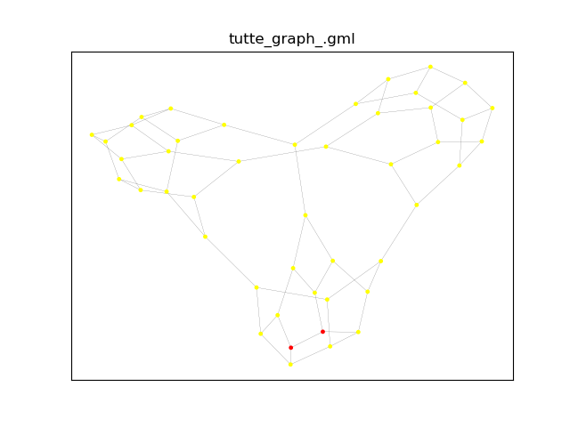
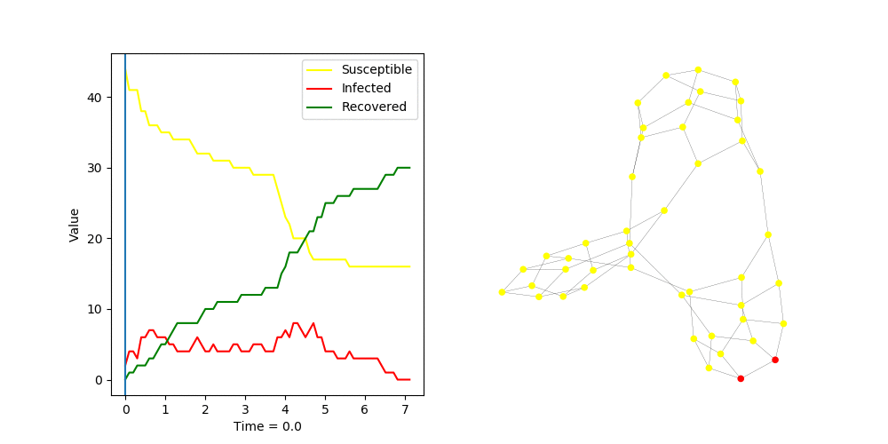
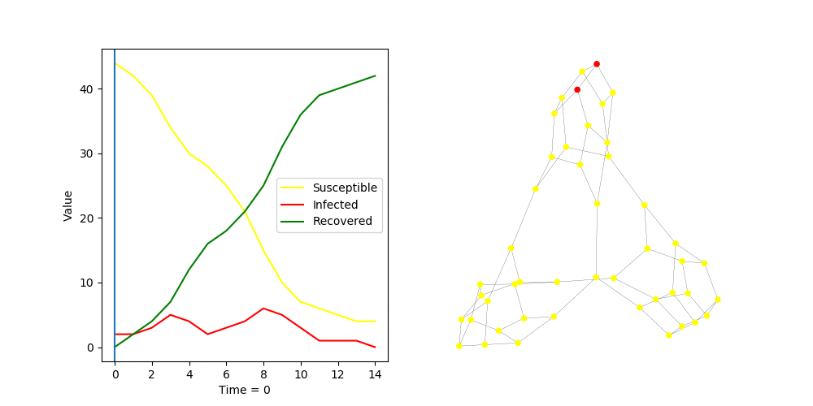
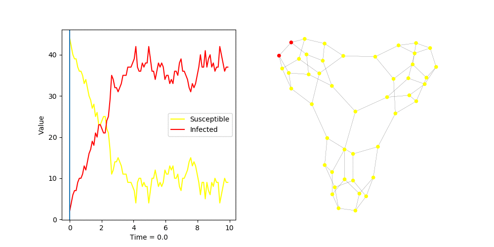
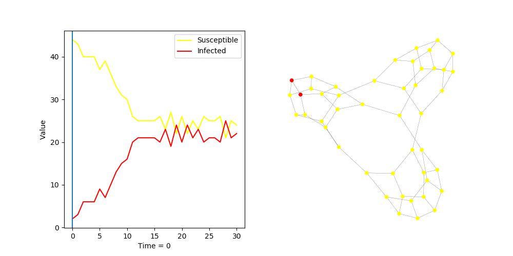
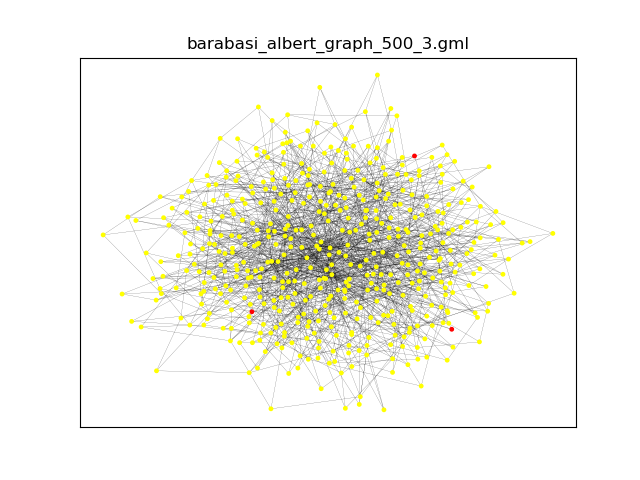
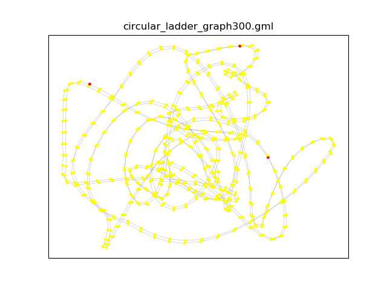
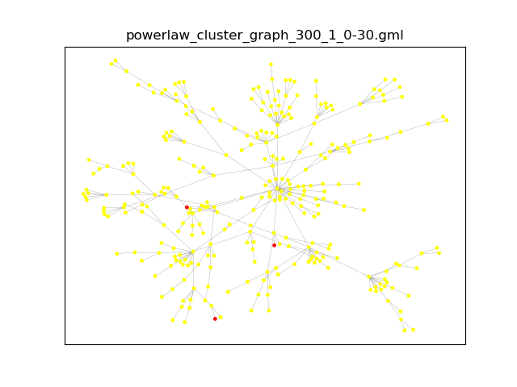

# GraphFlow
Projekt pozwala na symulacje przypływu w różnych typach sieci reprezentowanych jako grafy.
Obsługiwane typy sieci:
- sieci wodociągowe
- sieci epidemiczne

Głównym obszarem naszego zainteresowania były sieci epidemiczne. Poniżej znajudje sie opis różnych eksperymentów
 przeprowadzonych na tych sieciach.

## Przykład
Przykładaowe działanie programu dla grafu Tutte'a:

### Model SIR:
- algorytm _fast_:  
    parametry:
    - `transmission_rate = 2.0`
    - `recovery_rate = 1.0`

- algorytm _discrete_:  
    parametry:
    - `transmission_probability = 0.7`

### Model SIS:
- algorytm _fast_:  
    parametry:
    - `transmission_rate = 2.0`
    - `recovery_rate = 1.0`

- algorytm _discrete_:  
    parametry:
    - `transmission_probability = 0.7`

Algorytmy _fast_ sa dużo bardziej precyzyjne, więc będą częściej używane do eksperymetów. Algorytm _discrete_ dla 
 modelu SIS działa znacznie gorzej niż jego odpowiednik _fast_, nie będzie więc używany do testów.
 
## Eksperymenty:
- [Barabasi Albert](resources/barabasi_albert_graph/experiment.md)  

- [Circullar Ladder](resources/circular_ladder_graph/experiment.md)  

- [Power Cluster](resources/power_cluster/experiment.md)
