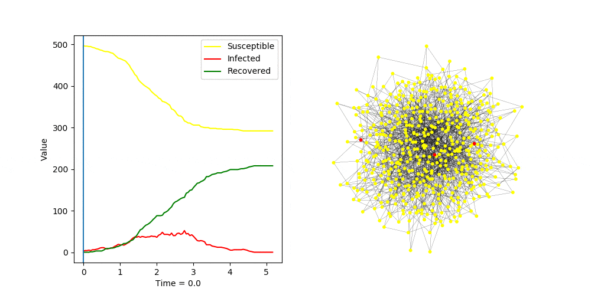
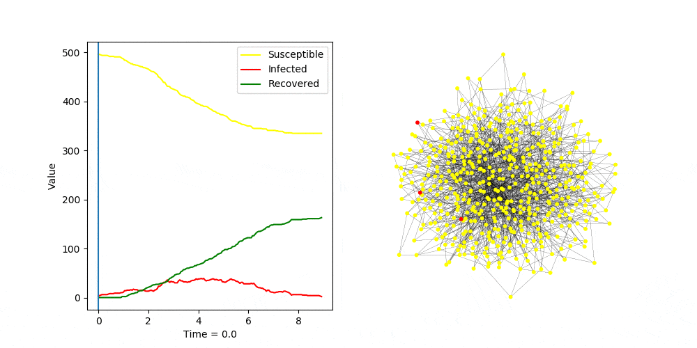
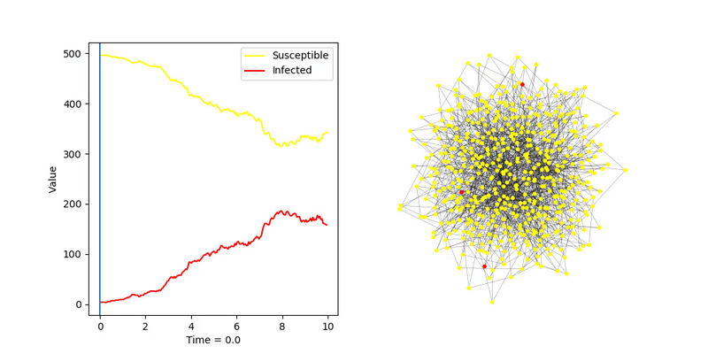

# Barabási–Albert

## SIR, algorytm _fast_

Wyniki testów dla modelu SIR i algorytmu _fast_ dla różnych parametrów.   
Moim celem było znalezienie parametrów, które pozwolą na zarażnie jak największej ilości węzłów, 
 ale tak by jednocześnie było zarażonych jak najmniej

Domyślne ustawienia:  
`transmission_rate = 2.0`  
`recovery_rate = 1.0`  

`transmission_rate = 0.5`  
`recovery_rate = 1.0`  

`transmission_rate = 0.5`  
`recovery_rate = 2.0`  
  
**Najlepszy wynik**

`transmission_rate = 0.3`  
`recovery_rate = 0-8`  

`transmission_rate = 0.2`  
`recovery_rate = 0-8`  
  
Również bardzo dobry wynik. Z powodu niższych wartości parametrów infekcja utrzymała się dłużej

## SIS, algorytm _fast_
Dla porównania wynik SIS (dla parametrów z ostatniego testu)
`transmission_rate = 0.2`  
`recovery_rate = 0-8`  
  
