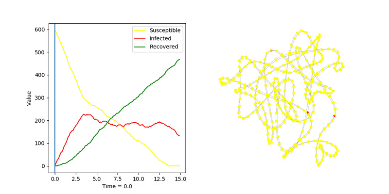
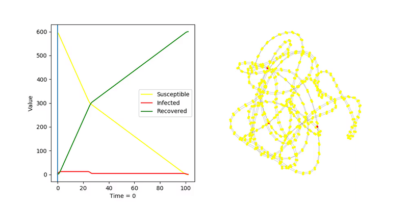

# Circular Ladder

## SIS, algorytm _fast_

Moim celem było zarażenie całego grafu, zakładając że węzły nie mogą wyzdrowieć
 
`transmission_rate = 5.0`  
`recovery_rate = 0.0`  

## SIR, algorytm _fast_

Następnie próbowałem znaleźć największą wartość paramtru `recovery_rate`, aby wszyskie węzły nadal
 zosały zarażony
 
`transmission_rate = 5.0`  
`recovery_rate = 0.2`  

## SIR, algorytm _discrete_

Algorytm dyskretny jest znacznie mniej precyzyjny. W każdym kroku zarażony node się leczy i zaraża
 sąsiednie z danym prawdopodobieństwem. Dla tego grafu wymagane było prawdopodobieństwo `1.0`
 
`transmission_probability = 1.0`
