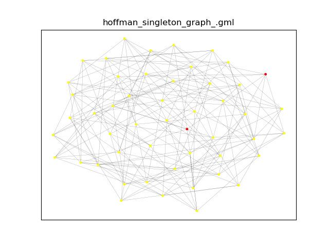
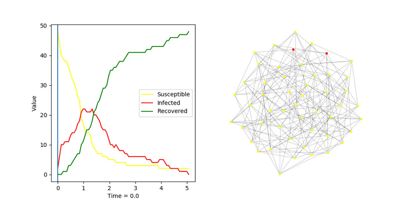
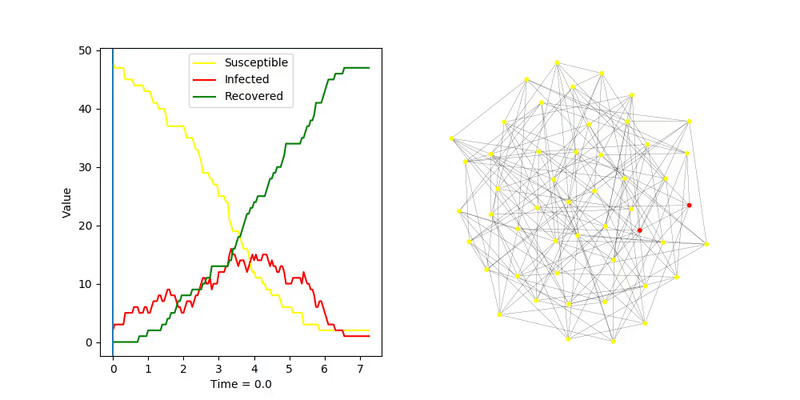
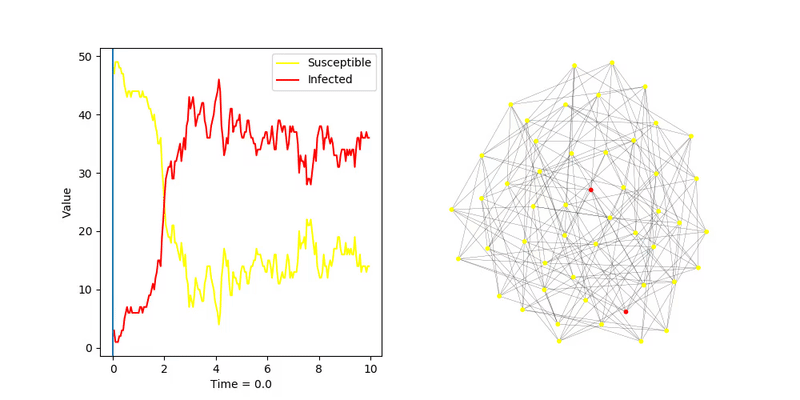
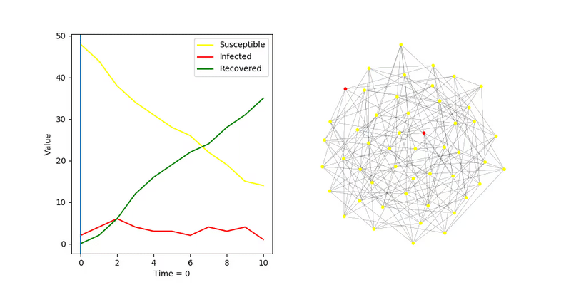

# Hoffman Singleton Graph

## SIR, algorytm _fast_
`transmission_rate = 0.5`  
`recovery_rate = 1.0`  

`transmission_rate = 0.3`  
`recovery_rate = 1.0`  

## SIS, algorytm _fast_
`transmission_rate = 0.3`  
`recovery_rate = 1.0`  

## SIR, algorytm _discrete_
Korzystając z własności grafu Hoffmana (każdy wierzchołek jest stopnia 7) można tak ustalić prawdopodobieństwo zarażnia
 sąsiada (`transmission_probability`), aby w każdym kroku była zarażna średnio taka sama ich ilość.  
W tym przypadku w każdym kroku jest zarażanych średnio 2 sąsiadów

`transmission_probability = 0.30`  

