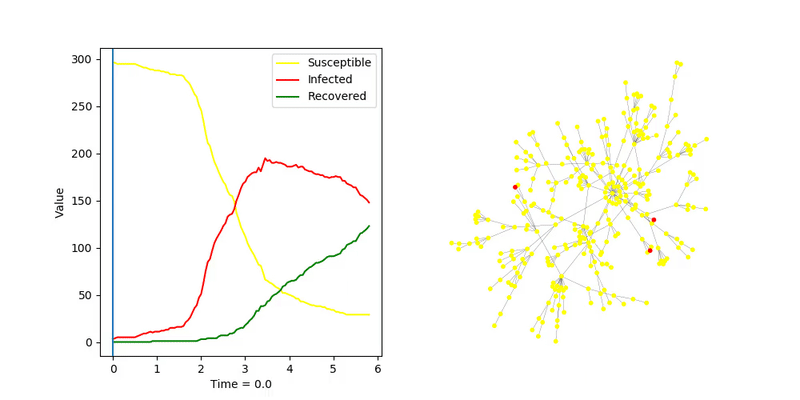
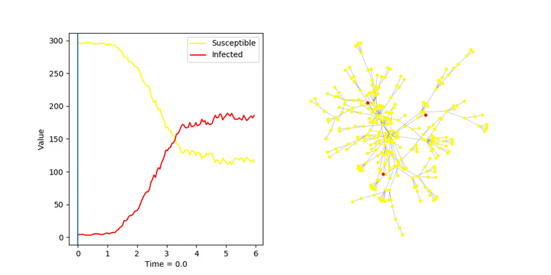
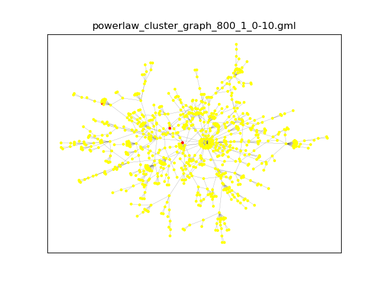
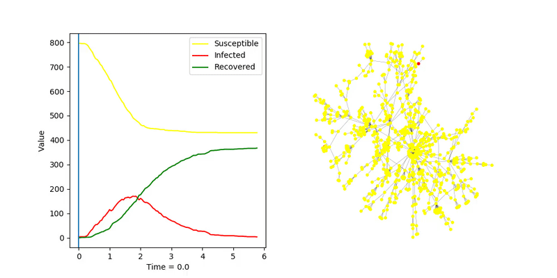
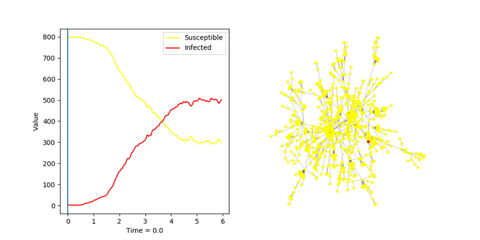

# Powerlaw Cluster

## SIR, algorytm _fast_
Test dla bardzo niskiego parametru `recovery_rate`
`transmission_rate = 2.0`  
`recovery_rate = 0.2`  

Infekcja zaczyna rozprzestrzeniać się szybko dopiero po zarażeniu jednego z centralnych wirzchołków

Dla znacznie wyższego `recovery_rate`

`transmission_rate = 2.0`  
`recovery_rate = 1.0`  
.gif)

`transmission_rate = 2.0`  
`recovery_rate = 1.0`  
.gif)

Powyższe dwa zostały wykonane dla dokładnie tego samego zestawu parametrów. Ilość jaką węzłów jaką infekcaja
 jest w stanie zarazić przed wygaśnięciem zależy od tego jak szbko zainfekuje centralny węzeł.

## SIS, algorytm _fast_
`transmission_rate = 2.0`  
`recovery_rate = 1.0`  

 
# Większy graf

Podobne eksperymenty wykonane dla grafu tego samego typu z większą ilością węzłów (800)

## SIR, algorytm _fast_
`transmission_rate = 2.0`  
`recovery_rate = 1.0`  

## SIS, algorytm _fast_
`transmission_rate = 2.0`  
`recovery_rate = 1.0`  

Wnioski podobne jak dla grafu mniejszego