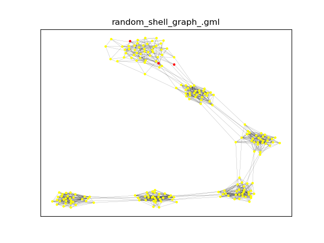
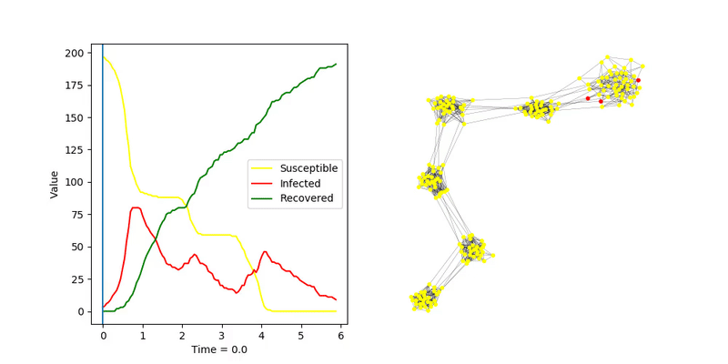
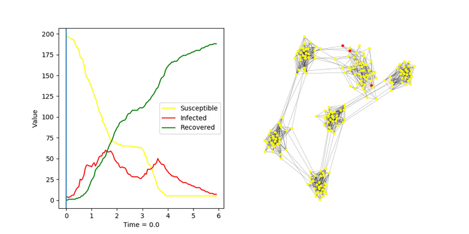
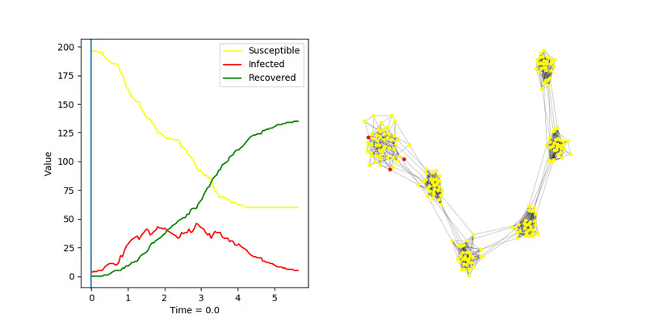
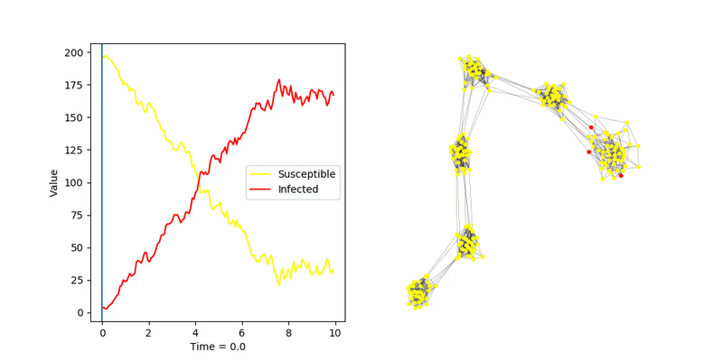
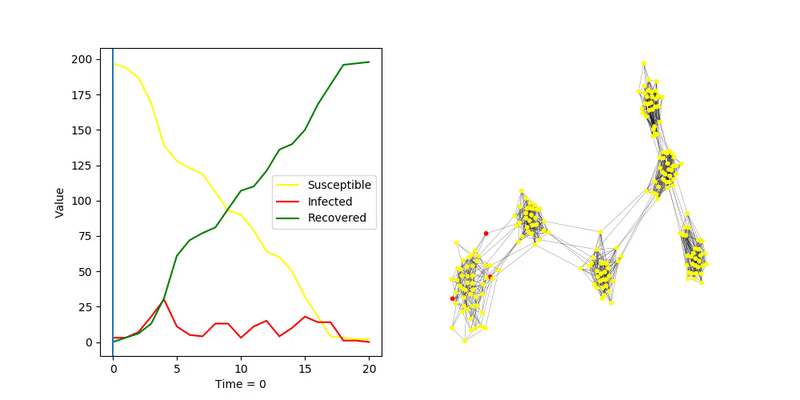

# Radnom Shell Graph

## SIR algorytm _fast_

Zmniejszałem parametr `transmission_rate` aż do momentu gdy zostały jakieś niezarażone węzły po wygaśnięciu infekcji

`transmission_rate = 1.0`  
`recovery_rate = 1.0`  

`transmission_rate = 1.0`  
`recovery_rate = 0.8`  

`transmission_rate = 1.0`  
`recovery_rate = 0.5`  

Można zaobserwować bardzo szybkie zarażanie dużych zbiorowisk węzłów, po tym jak jeden z nich zostanie zainfekowany. 
Choroba dużo trudniej przenosi się na sąsiednie grupy.

## SIS, algorytm _fast_

Podobny eksperyment dla SIS

`transmission_rate = 1.0`  
`recovery_rate = 0.5`  

## SIR, algorytm _discrete_

I dla algorytmu dyskretnego

`transmission_probability = 0.35`  
