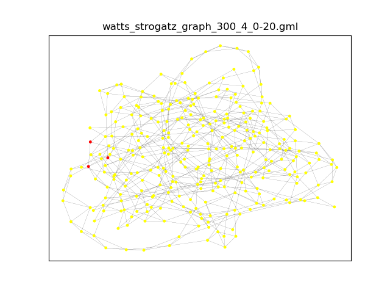
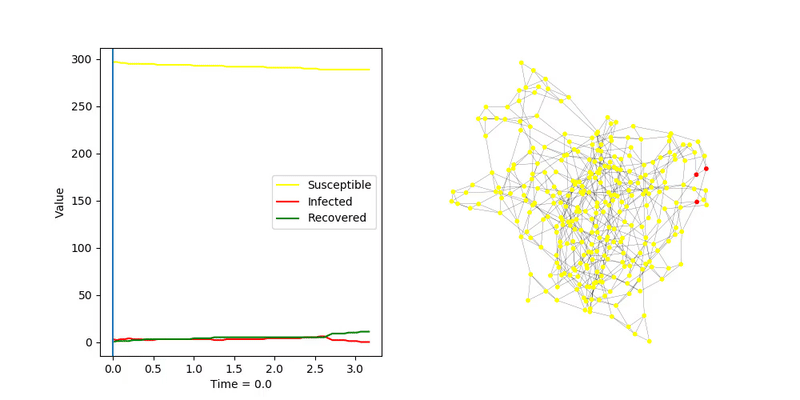
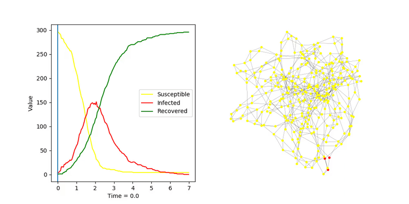
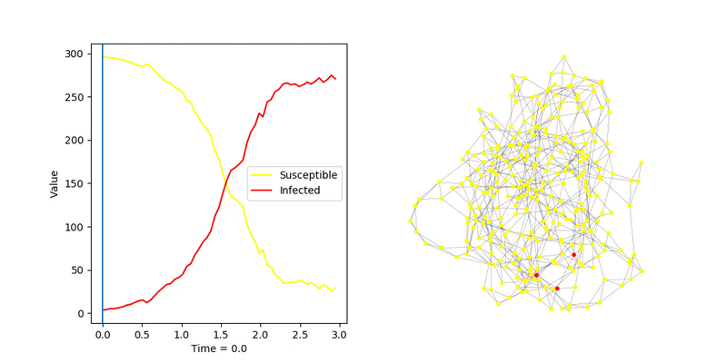
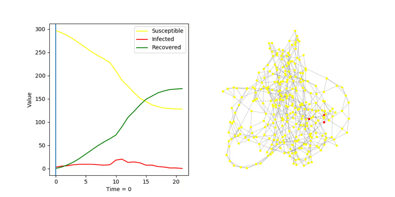
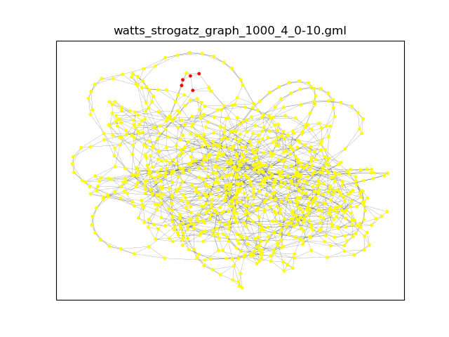
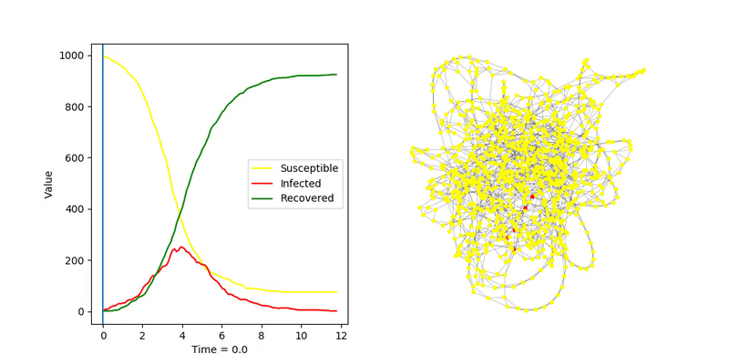
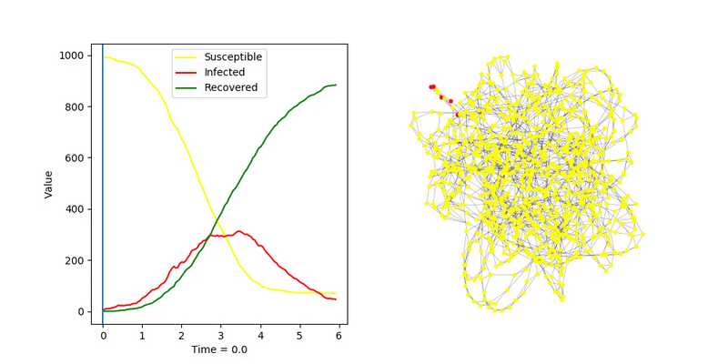
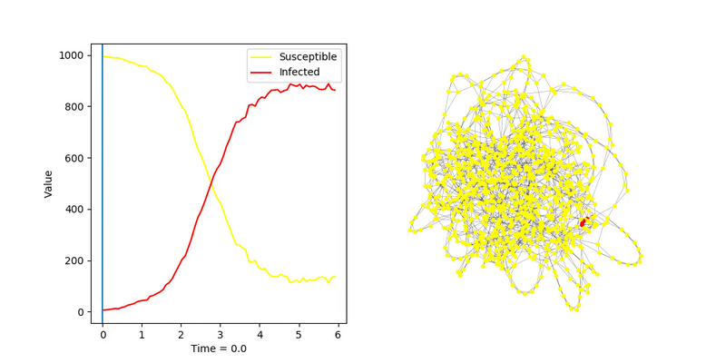
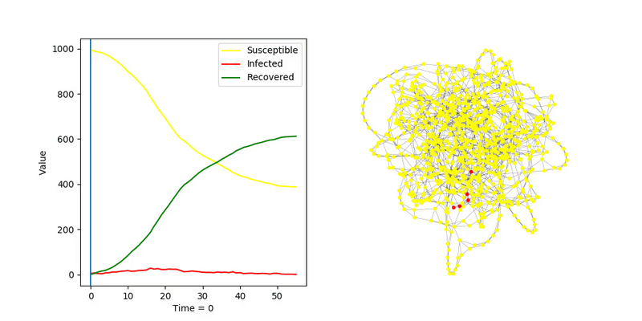

# Watts-Strogatz Graph

## SIR, algorytm _fast_
`transmission_rate = 2.0`  
`recovery_rate = 1.0`  

Infekcja się nie rozprzestrzenia, za mało połączeń z zainfekowanymi

`transmission_rate = 2.5`  
`recovery_rate = 1.0`  

Po zwiększeniu `trasmission_rate` infekcja dochodzi do węzłów o dużym stopniu, następuje gwałtowny wzrost ilości
 zarażonych. Prawie cała sieć zotaje zainfekowana

## SIS, algorytm _fast_
`tranmission_rate = 2.5`  
`recovery_rate = 1.0`  

## SIR, algorytm _discrete_
`transmission_probability = 0.5`  

# Większy graf

Podobne eksperymenty wykonane dla grafu tego samego typu z większą ilością węzłów (1000)

## SIR, algorytm _fast_
`transmission_rate = 2.0`  
`recovery_rate = 1.0`  

`transmission_rate = 2.5`  
`recovery_rate = 1.0`  

## SIS, algorytm _fast_
`transmission_rate = 2.0`  
`recovery_rate = 1.0`  

## SIR, algorytm _discrete_
`transmission_probability = 0.5`  

Infekcja zachowuje się podobnie jak w mniejszej sieci
